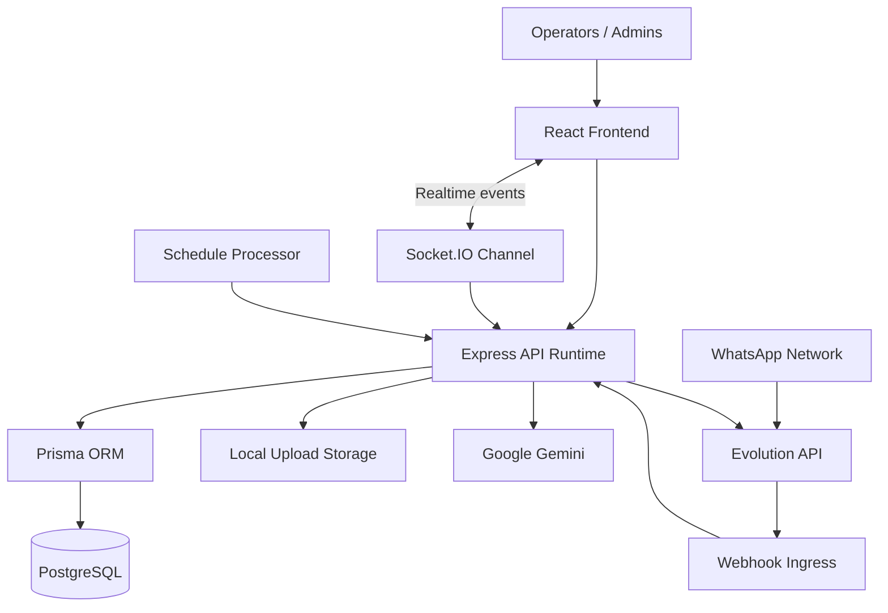
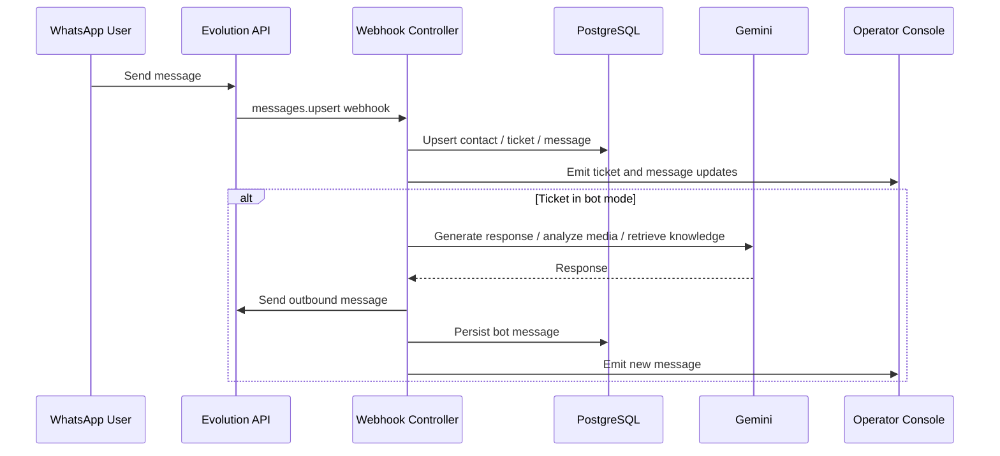
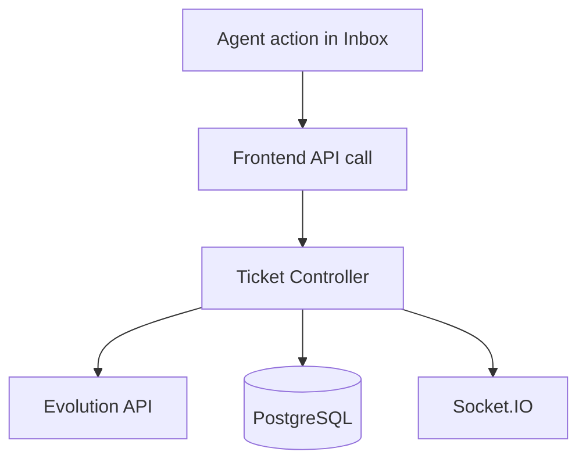
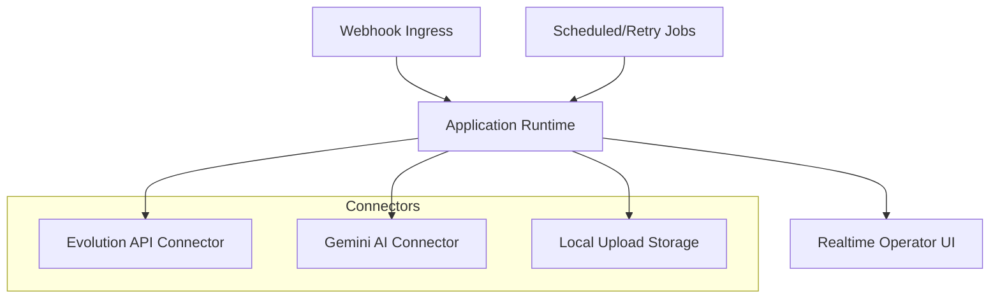
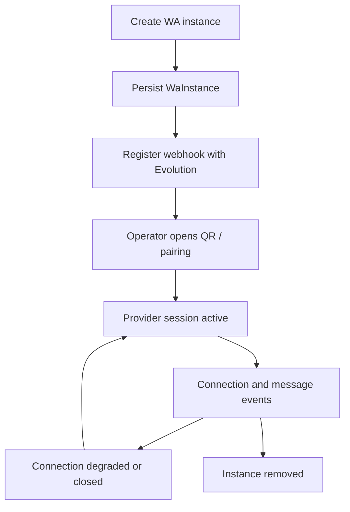
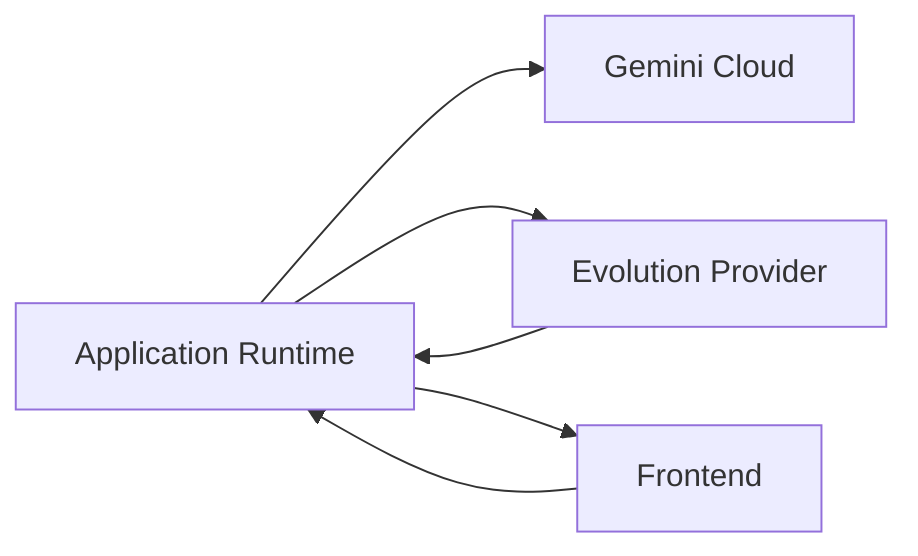

# Architecture Overview

## Executive Overview

This repository implements a multi-tenant AI-assisted customer operations platform focused on conversational support, queue orchestration, and WhatsApp-based service execution.

The current production architecture is centered on:

- a Node.js application server that owns orchestration logic
- a PostgreSQL persistence layer accessed through Prisma
- an external messaging runtime provided by Evolution API
- an AI execution layer backed by Google Gemini
- a React operator console with real-time updates over Socket.IO

Although the product presents as a chat workspace, the codebase behaves more like an operational coordination layer:

- inbound events are provider-driven through webhooks
- runtime state is persisted in relational models instead of in-memory agents
- AI is embedded as a decision subsystem rather than the system boundary
- scheduling, retries, media recovery, and queue assignment are first-class operational concerns

Assumption notes:

- WhatsApp orchestration is fully implemented through Evolution API.
- Meta/Facebook/Instagram browser-backed runtime is not implemented in active controllers, but the schema already reserves `MetaInstance` and `metaBrowserSession` for future hybrid connectors.
- The system is currently server-centric rather than edge-agent-centric.

## Recent Platform Evolution - May 15, 2026

The platform changed materially on May 15, 2026 across both product workflow and runtime structure.

Highlights:

- the operator console was reworked around shared UI primitives under `frontend/src/components/ui/`
- the inbox was decomposed into `frontend/src/pages/inbox/components.jsx`, `hooks.js`, and `helpers.jsx`
- the frontend moved to route-level lazy loading and an application-level render fallback in `frontend/src/main.jsx`
- inbox rendering was hardened against malformed provider payloads, missing media metadata, and inconsistent history records
- business-hours evaluation now defaults to `America/Sao_Paulo` and treats inactive days as closed
- AI summaries were narrowed to recent conversation windows for transfer and manual summary workflows
- frontend deployment was hardened through explicit build/start configuration in `frontend/nixpacks.toml` and `frontend/package.json`

Detailed release notes:

- see [docs/updates/2026-05-15.md](./updates/2026-05-15.md)

## High-Level Architecture

## Core Components

### 1. API and Orchestration Runtime

Primary file: `backend/src/app.js`

Responsibilities:

- boot Express HTTP API
- boot Socket.IO real-time channel
- mount route domains
- initialize background processing
- expose static uploads
- coordinate controller-level event emitters

### 2. Messaging Orchestrator

Primary files:

- `backend/src/controllers/webhookController.js`
- `backend/src/controllers/ticketController.js`
- `backend/src/services/evolutionService.js`

Responsibilities:

- receive provider events
- normalize inbound messages and media
- create or reopen tickets
- persist message timeline
- route chats between bot, queue, and human agent
- send outbound text, media, audio, revocation, and scheduled messages

### 3. AI Execution Layer

Primary file: `backend/src/services/geminiService.js`

Responsibilities:

- conversational response generation
- transfer summaries
- semantic knowledge retrieval support through embeddings
- image analysis and audio transcription
- structured extraction for service order drafts and contact memory

### 4. Tenant Control Plane

Primary domains:

- auth
- users
- teams
- settings
- superadmin
- tags
- quick responses

Responsibilities:

- tenant isolation
- plan limits
- access control
- business hours
- branding and workspace configuration

### 5. Operational Data Plane

Primary models:

- `Tenant`
- `TenantSettings`
- `WaInstance`
- `Contact`
- `Ticket`
- `Message`
- `TicketEvent`
- `ScheduledMessage`
- `Knowledge`
- `Equipment`
- `ServiceOrder`

Responsibilities:

- persist execution state
- represent queue and assignment lifecycle
- provide auditability and CRM-like context

### 6. Frontend Operations Console

Primary files:

- `frontend/src/pages/Inbox.jsx`
- `frontend/src/pages/inbox/components.jsx`
- `frontend/src/pages/inbox/hooks.js`
- `frontend/src/pages/inbox/helpers.jsx`
- `frontend/src/components/ui/`
- `frontend/src/services/api.js`
- `frontend/src/services/socket.js`
- `frontend/src/main.jsx`

Responsibilities:

- operator inbox
- real-time ticket and message updates
- queue management
- AI summary access
- settings and admin workflows
- route-level code splitting and loading fallbacks
- render isolation for unstable conversation sections

## Runtime Responsibilities

The backend is not a passive CRUD API. It owns active runtime responsibilities:

- webhook normalization
- ticket lifecycle transitions
- provider connection state observation
- media retry and recovery
- scheduled outbound execution
- AI invocation routing
- queue status updates over Socket.IO
- business-hour gating

## Cloud vs Local Responsibilities

### Cloud / External Responsibilities

- Google Gemini for LLM, embeddings, vision, and transcription
- Evolution API for WhatsApp transport, webhook emission, and provider session state
- PostgreSQL hosting when deployed remotely

### Local / Application Responsibilities

- orchestration logic
- tenant policy enforcement
- media persistence under `/uploads`
- ticket and message persistence
- scheduled processing
- Socket.IO fan-out
- CRM and service-order data model

## Data Flow

### Inbound Conversation Flow

### Outbound Human Response Flow

## Operational Model

The system uses a centralized application runtime with event-driven boundaries.

Key operating principles:

- inbound state is webhook-first
- outbound state is command-driven through REST controllers
- UI consistency is maintained through Socket.IO event propagation
- background work is interval-based, not queue-backed
- AI execution is invoked synchronously for interactive actions and asynchronously for some enrichment tasks

## Connector Orchestration

## Session Lifecycle

## Cloud-Agent Communication

The product does not currently run a separate local agent binary. The effective communication pattern is application-to-cloud-provider and provider-to-application webhook return.

## Future Evolution

Reasonable next architectural steps, based on current code shape:

- move interval-based background work to queue-backed workers
- formalize connector contracts across messaging, AI, and CRM providers
- expand `MetaInstance` into an actual hybrid browser/API connector runtime
- externalize media processing and long-running AI enrichment jobs
- introduce event logs or outbox patterns for stronger delivery guarantees
- split tenant control plane from conversation execution plane
