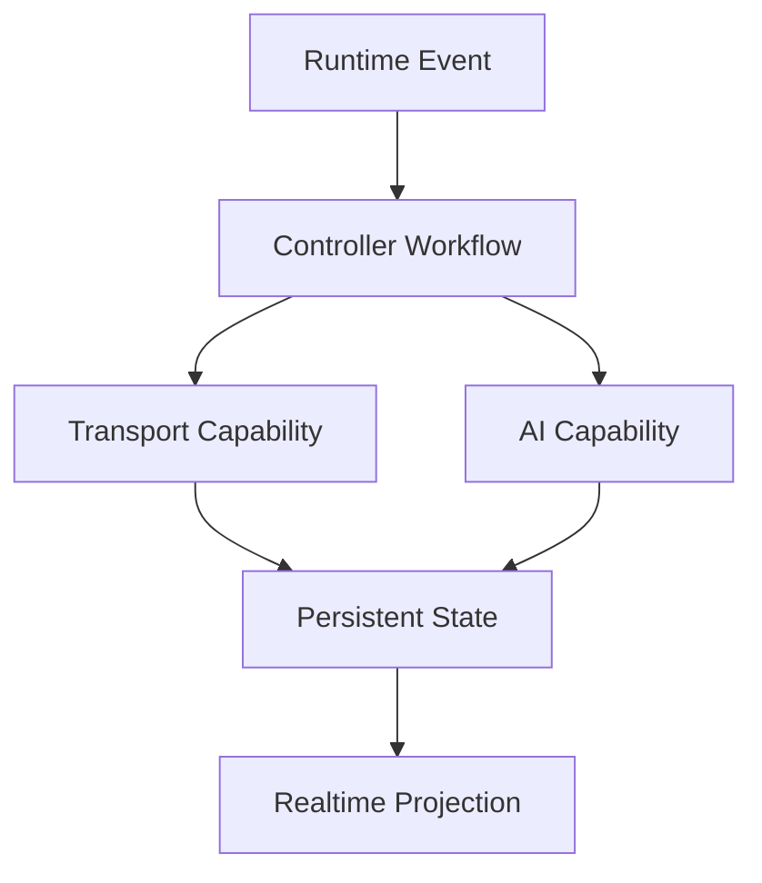

# Capability Model

## Capability Abstraction Philosophy

The codebase currently encodes capabilities as service functions and controller workflows rather than as declarative manifests.

Even so, the architecture already follows a capability-oriented pattern:

- transports expose message delivery capabilities
- AI services expose reasoning and enrichment capabilities
- runtime services expose scheduling, recovery, and audit capabilities

This is useful because future infrastructure can formalize the same model without rewriting product behavior.

## Current Capability Domains

### Transport Capabilities

- instance provisioning
- QR and pairing retrieval
- text delivery
- media delivery
- audio delivery
- message revocation
- connection state inspection
- webhook registration

### AI Capabilities

- response generation
- executive summarization
- transfer summarization
- semantic retrieval
- image description
- audio transcription
- contact memory extraction
- service order drafting

### Operational Capabilities

- ticket assignment
- unread count tracking
- business-hour enforcement
- scheduled message execution
- media recovery
- ticket audit trail

## Capability Schema

Recommended normalized schema:

```json
{
  "provider": "google_business",
  "mode": "browser",
  "capabilities": [
    "auth_browser",
    "profile_read",
    "locations_discovery"
  ]
}
```

### Messaging Example

```json
{
  "provider": "evolution_whatsapp",
  "mode": "api",
  "capabilities": [
    "instance_create",
    "qrcode_fetch",
    "webhook_subscribe",
    "message_send_text",
    "message_send_media",
    "message_receive_webhook"
  ]
}
```

### AI Example

```json
{
  "provider": "google_gemini",
  "mode": "api",
  "capabilities": [
    "chat_generate",
    "summary_generate",
    "embedding_generate",
    "audio_transcribe",
    "image_analyze"
  ]
}
```

## Runtime Capability Execution

Capabilities are executed through orchestration layers:

- controllers decide when to invoke a capability
- services implement the provider-specific call
- persistence models record the result
- Socket.IO publishes state changes

Example flow:

1. webhook receives customer media
2. runtime persists message in pending state
3. messaging capability attempts media fetch
4. AI capability optionally transcribes or analyzes content
5. runtime decides whether bot response should be generated

## Extensibility Model

A clean next step would be to introduce explicit capability descriptors per connector.

Benefits:

- provider substitution
- safer feature flags
- startup due diligence clarity
- easier future MCP compatibility

A practical interface could include:

- provider identity
- execution mode
- auth strategy
- capability list
- health state
- tenant enablement

## Capability Interaction Diagram



