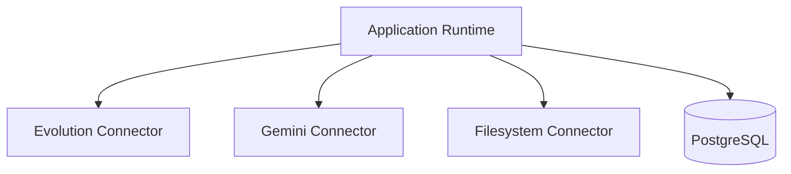

# Connector Strategy

## Connector Abstraction Model

The repository does not yet define a formal connector interface class, but connector behavior is already implemented as service-level adapters.

Current connector categories:

- messaging transport connector
- AI inference connector
- file/media persistence connector

Concrete implementations:

- `backend/src/services/evolutionService.js`
- `backend/src/services/geminiService.js`
- local filesystem access under `uploads/`

## Current Connector Modes

### API-Based Connectors

Implemented today:

- Evolution API
- Google Gemini API

Characteristics:

- stateless HTTP calls from the application server
- credentials stored per tenant settings
- request/response orchestration inside controllers and services

### Browser-Based Connectors

Not implemented in active runtime.

Reserved architecture exists through:

- `MetaInstance`
- `metaBrowserSession`

Interpretation:

- the codebase anticipates future hybrid connectors for Facebook or Instagram
- browser session persistence is a planned extension point, not a deployed subsystem

## Authentication Strategies

### Evolution API

- API key in request headers
- provider base URL stored in tenant settings or environment defaults

### Gemini

- direct API key usage per tenant
- model fallback strategy for degraded availability

### Application API

- JWT bearer tokens
- token reused for Socket.IO authentication

## Resource Discovery

Current discovery patterns:

- WhatsApp instances discovered from local database and validated against provider state
- contacts discovered implicitly through inbound webhook traffic
- teams and knowledge resources loaded from PostgreSQL
- media availability discovered through deferred provider fetch attempts

## Capability Registration

Capabilities are implicit today.

Examples:

- Evolution connector registers transport behaviors such as `sendText`, `sendMedia`, `getQrCode`, `setWebhook`
- Gemini connector registers inference behaviors such as `chat`, `summarize`, `transcribeAudio`, `getEmbedding`

The system would benefit from explicit capability metadata for future provider substitution.

## Sync Behavior

### Messaging Sync

- inbound sync is webhook-based
- outbound sync is command-based
- UI sync is event fan-out through Socket.IO

### Media Sync

- metadata is persisted immediately
- binary resolution can be asynchronous
- retry loop backfills failed or pending media URLs

### Connection Sync

- explicit state checks through Evolution API
- asynchronous connection updates through webhook events

## Examples

### Current API-Based Connector Example

```json
{
  "provider": "evolution_whatsapp",
  "mode": "api",
  "capabilities": [
    "instance_create",
    "qrcode_fetch",
    "connection_state_read",
    "webhook_register",
    "message_send_text",
    "message_send_media",
    "message_revoke"
  ]
}
```

### Current AI Connector Example

```json
{
  "provider": "google_gemini",
  "mode": "api",
  "capabilities": [
    "chat_generation",
    "summary_generation",
    "audio_transcription",
    "image_analysis",
    "embedding_generation",
    "structured_drafting"
  ]
}
```

### Planned Hybrid Connector Example

```json
{
  "provider": "meta_business",
  "mode": "hybrid_browser_api",
  "capabilities": [
    "auth_browser",
    "session_persistence",
    "profile_read",
    "message_sync",
    "fallback_browser_automation"
  ],
  "status": "planned_not_implemented"
}
```

## Connector Orchestration Diagram



