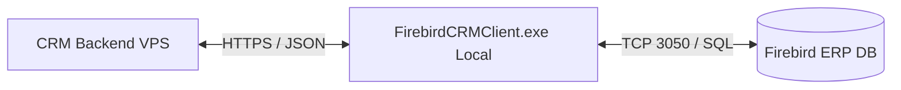
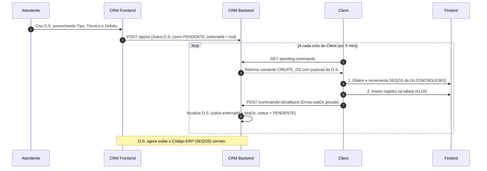

# Integração ERP ILUX (Firebird) & CRM Multiatendimento

Este documento descreve a arquitetura, o fluxo de comunicação e as especificações técnicas da integração entre o banco de dados Firebird local do ERP ILUX e o Sistema de Multiatendimento (CRM). 

Use este guia como referência para futuras manutenções, evitando que alterações quebrem a consistência de dados ou causem bugs de renderização no ERP.

---

## 1. Visão Geral da Arquitetura

A integração é híbrida e assíncrona, composta por três partes principais:

1. **CRM Backend (Node.js/Express na VPS):**
   - Expõe endpoints protegidos por token para recebimento de dados em lote (`/api/integrations/firebird/push`).
   - Mantém uma fila de comandos pendentes no endpoint `/api/integrations/firebird/pending-commands` (por exemplo, quando um atendente abre uma O.S. no CRM).
   - Fornece um callback (`/api/integrations/firebird/commands/:id/callback`) para receber confirmações do client local.

2. **Client de Integração (`firebird-client` - Executável no Servidor Local):**
   - Script em Python (`main.py`) compilado para um executável autônomo do Windows (`FirebirdCRMClient.exe`).
   - Roda em loop contínuo (padrão 300s / 5 minutos) no servidor onde o banco de dados Firebird (`.FDB`) está localizado.
   - Sincroniza metadados (técnicos, tipos de O.S.) e entidades (clientes, equipamentos) do ERP para o CRM via HTTPS (apenas tráfego de saída).
   - Consome a fila de comandos de criação de O.S. do CRM, insere-as diretamente no Firebird e devolve o código gerado (`SEQOS`) via callback.

3. **Banco de Dados Firebird (ERP ILUX):**
   - Tabela `ICLIENTES`: Cadastro de clientes.
   - Tabela `IXLEQUIPAMENTO`: Cadastro de equipamentos.
   - Tabela `IXLOS`: Cadastro das ordens de serviço.
   - Tabela `IXLCONTROLESEQ`: Tabela que armazena os sequenciais das tabelas (geradores manuais).
   - Tabela `IXLOSDEFEITOTP`: Tabela de tipos de defeito cadastrados no ERP.



---

## 2. Fluxo de Criação de O.S. (Passo a Passo)



---

## 3. Especificação do Schema `IXLOS` (Campos Críticos)

Ao inserir um novo registro de O.S. (`IXLOS`) no Firebird, diversos campos são obrigatórios ou possuem dependências de integridade do ERP. O não preenchimento correto desses campos causa inconsistências graves.

### Tabela de Mapeamento de Campos do `insert into IXLOS`

| Campo ERP | Tipo | Origem CRM / Valor Fixo | Descrição |
| :--- | :--- | :--- | :--- |
| **SEQOS** | INTEGER | `IXLCONTROLESEQ` | Chave primária. Deve ser obtida e incrementada manualmente da tabela de controle. |
| **CDCLIENTE** | INTEGER | `contact.externalId` | ID do Cliente associado. |
| **CDCLIENTEENT** | INTEGER | `contact.externalId` | ID do Cliente de entrega/local (mesmo valor do cliente). |
| **CDEQUIPAMENTO** | INTEGER | `equipment.externalId` | ID do Equipamento importado do ERP. |
| **CDOSTP** | VARCHAR | `os.cdOstp` | Código do Tipo de O.S. selecionado no modal (Ex: `'01'`, `'02'`). |
| **DTINCLUSAO** | DATE | `now()` | Data de criação (formato `YYYY-MM-DD`). |
| **HRINCLUSAO** | TIME | `now()` | Hora de criação (formato `HH:MM`). |
| **STATUS** | VARCHAR | `'E'` | Status de fluxo (Mapeado como `'E'` para Aberto / Pendente de execução). |
| **CDSTATUS** | VARCHAR | `'E1'` | Código detalhado do status inicial (Mapeado como `'E1'`). |
| **OBSDEFEITOCLI** | BLOB/SUB_TYPE 1 | `os.defect` | Relato do defeito fornecido pelo cliente. |
| **NMSUPORTET** | VARCHAR | `os.nmsuportet` | Nome do Técnico encarregado (Ex: `'ROBSON'`). |
| **NMSUPORTEA** | VARCHAR | `user.firebirdSupportName` | Nome do Atendente do CRM que abriu o chamado. |
| **DTPREVENTREGA** | DATE | `now() + 3 dias` | Previsão de entrega estimada (formato `YYYY-MM-DD`). |
| **HRPREVENTREGA** | TIME | `now()` | Hora prevista (mesmo valor de `HRINCLUSAO`). |
| **CDDEFEITO** | VARCHAR | **`'MAN'`** | **Crítico:** Código do Tipo de Defeito (tabela `IXLOSDEFEITOTP`). |
| **PRIORIDADE** | VARCHAR | `'24'` | Código da prioridade configurado no ERP (Ex: `'24'`). |
| **ATUALIZADO** | VARCHAR | `DD/MM/YYYY HH:MM:SS CA I` | String de auditoria interna do ERP ILUX (Ex: `19/06/2026 17:44:09 CA I`). |

---

## 4. O Bug do PDF/Relatório em Branco no ERP ILUX

> [!IMPORTANT]
> **O que acontecia:**
> As ordens de serviço inseridas pelo CRM via integração apareciam normalmente na tela de pesquisa e visualização do ILUX. No entanto, ao tentar **imprimir** a O.S. (gerar o PDF/Relatório), a página do relatório saía **completamente em branco**.

### A Causa Raiz
O motor de relatórios do ILUX executa uma query SQL que possui uma junção estrita (`INNER JOIN`) entre a tabela principal `IXLOS` e a tabela `IXLOSDEFEITOTP` (tabela que cataloga tipos de defeito):

```sql
SELECT ... 
FROM IXLOS os
INNER JOIN IXLOSDEFEITOTP def ON (os.CDDEFEITO = def.CDDEFEITO)
WHERE os.SEQOS = ?
```

Como o nosso script de integração inseria `CDDEFEITO = NULL` (ou omitia a coluna), o `INNER JOIN` falhava em encontrar correspondência e retornava **zero linhas**. Para o gerador de relatórios, sem registros retornados na query base, o PDF era renderizado em branco.

### A Solução Aplicada
1. Adicionamos a inserção de `CDDEFEITO = 'MAN'` (Código correspondente à "Manutenção de Equipamento", que existe previamente na tabela `IXLOSDEFEITOTP` do ERP).
2. Adicionamos o campo `PRIORIDADE = '24'`.
3. Preenchemos o campo de auditoria `ATUALIZADO` com o padrão de auditoria do ILUX: `f"{now.strftime('%d/%m/%Y %H:%M:%S')} CA I"` (onde `CA` é a sigla/código do usuário do sistema e `I` indica que foi Incluído).
4. Mapeamos os campos adicionais de previsão de entrega (`DTPREVENTREGA` e `HRPREVENTREGA`) para que os tempos de SLA do ERP funcionem perfeitamente.
5. Inserimos placeholders de string vazia (`''`) para colunas secundárias (`FORMULARIOOS`, `SEQOSCLI`, `NMSUPORTEL`, `NR_CAU`, `NR_RP`) em vez de deixá-las como `NULL`.

---

## 5. Sequenciamento de ID (Gerador Manual `IXLCONTROLESEQ`)

O banco Firebird do ILUX não utiliza geradores nativos (`GENERATORS`/`SEQUENCES`) atrelados a triggers automáticas de inserção para o campo `SEQOS`. Em vez disso, ele centraliza o controle na tabela `IXLCONTROLESEQ`.

Para evitar colisões e erros de violação de chave primária, o client executa o seguinte algoritmo antes de inserir na `IXLOS`:

1. Executa um select com trava/atualização na tabela de controle:
   ```sql
   SELECT SEQUENCIAL FROM IXLCONTROLESEQ WHERE TABELA = 'ORDEMSERVICO'
   ```
2. Caso encontre o valor:
   - Incrementa em 1 (`seq_os = sequencial + 1`).
   - Atualiza a tabela: `UPDATE IXLCONTROLESEQ SET SEQUENCIAL = ? WHERE TABELA = 'ORDEMSERVICO'`.
   - Utiliza esse valor explicitamente na query de `INSERT INTO IXLOS`.
3. Caso falhe (tabela ausente ou erro de transação):
   - Executa `SELECT MAX(SEQOS) FROM IXLOS` como plano de contingência.
   - Incrementa o valor em 1.
   - Tenta atualizar a `IXLCONTROLESEQ` com o novo sequencial e usa-o no `INSERT`.

---

## 6. Vinculação de Atendente no Perfil do Usuário

Para preencher corretamente as colunas `NMSUPORTET` (Técnico) e `NMSUPORTEA` (Atendente de abertura) de acordo com o usuário logado no CRM:

1. Foi adicionado o campo `firebirdSupportName` no modelo `User` do Prisma (`backend/prisma/schema.prisma`).
2. No painel de administração de usuários do CRM, o administrador pode mapear qual é o nome correspondente do técnico/atendente no Firebird local (Ex: `ROBSON`, `CAIO`).
3. Ao gerar comandos de O.S., o backend busca o `firebirdSupportName` do usuário associado e o envia no payload como `attendantName`.

---

## 7. Compilação do Executável (`firebird-client`)

O client local roda como um executável de 64 bits do Windows para que não seja necessária a instalação de interpretadores Python e pacotes de terceiros no servidor da empresa.

### Requisitos para compilar
- Windows 10/11 ou Windows Server
- Python 3.10+ instalado localmente
- Dependências instaladas: `pip install -r requirements.txt` (inclui `firebirdsql`, `requests`, `python-dotenv` e `pyinstaller`)

### Instruções para compilação
No terminal do Windows, dentro do diretório `firebird-client`:

```powershell
# 1. Instalar dependências
pip install -r requirements.txt

# 2. Executar o empacotamento com PyInstaller
pyinstaller --onefile --name=FirebirdCRMClient main.py
```

O arquivo compilado estará disponível na pasta `firebird-client/dist/FirebirdCRMClient.exe`.

> [!WARNING]
> Sempre que houver qualquer modificação no arquivo `firebird-client/main.py`, o executável **deve** ser recompilado e a nova versão copiada para a pasta de produção no servidor local da empresa, substituindo o executável anterior.
