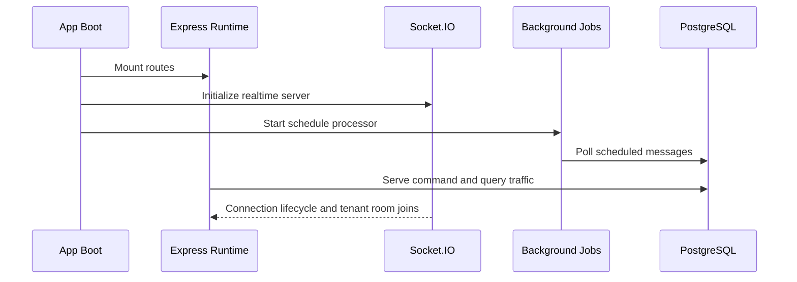

# Runtime Model

## Scope

This document describes the runtime behavior of the current repository, which is implemented as a centralized Node.js orchestration server rather than a fleet of autonomous agents.

## Runtime Topology

The runtime has four active execution modes:

- synchronous HTTP request handling
- webhook-driven provider event ingestion
- Socket.IO real-time fan-out
- interval and cron-based background processing

## Agent Lifecycle

The product does not currently implement a standalone local agent process. The closest equivalent is the application runtime plus provider-backed messaging sessions.

Lifecycle phases:

1. boot server and mount routes
2. initialize Socket.IO
3. initialize background schedulers
4. process operator requests
5. ingest provider webhooks
6. persist state mutations
7. emit real-time UI updates

## Heartbeat System

Current heartbeat behavior is implemented primarily through Socket.IO transport settings in `backend/src/app.js`.

Observed settings:

- `pingTimeout: 60000`
- `pingInterval: 25000`
- `connectTimeout: 45000`
- transports: websocket and polling

This heartbeat covers operator-console connectivity, not provider connectivity.

Provider session health is inferred separately through:

- Evolution connection state polling in `instanceController.list`
- webhook `connection.update` events

## Reconnect Logic

### Frontend Reconnect

The frontend uses Socket.IO client reconnection behavior in the inbox workflow and refreshes tickets on reconnect.

### Provider Reconnect

Provider reconnect is handled operationally rather than by a local protocol stack:

- QR code and pairing are managed through Evolution
- provider disconnections trigger `connection.update`
- the backend propagates the event to the tenant room
- admins can reconnect the affected instance through the console

### Runtime Retry Loops

The background processor also includes recovery logic for media:

- pending media is retried every 5 minutes
- stale pending media is marked failed after threshold expiration

## Session Persistence

Session persistence exists at three layers:

### 1. Provider Session Persistence

WhatsApp connection state is effectively owned by Evolution API.

### 2. Application Persistence

The application stores durable operational context:

- instances
- contacts
- tickets
- messages
- ticket events
- scheduled work
- knowledge artifacts

### 3. Local File Persistence

Media assets are stored under local `uploads/` paths and served statically.

## Browser Orchestration

Current production runtime does not execute a browser automation layer.

Important nuance:

- the Prisma schema includes `MetaInstance` and `metaBrowserSession`
- this indicates planned support for browser-backed or hybrid session persistence for Meta channels
- no active browser runtime exists in the current controllers or services

The repository is therefore API-first today, with reserved schema for future hybrid execution.

## Runtime State Management

The dominant state manager is PostgreSQL through Prisma.

State coordination patterns:

- `Ticket.status` controls queue state
- `Ticket.agentId` determines ownership
- `Ticket.unreadCount` tracks operator attention
- `Message.mediaStatus` manages media recovery lifecycle
- `TicketEvent` acts as an append-only operational history stream

The runtime uses database state as the source of truth and Socket.IO as a projection channel.

## Failure Recovery

### Request-Level Failures

- controller `try/catch` blocks return HTTP errors
- performance logging highlights slow endpoints
- global `uncaughtException` and `unhandledRejection` handlers log fatal failures

### Provider-Level Failures

- Evolution requests are wrapped with retries or fallbacks where appropriate
- media retrieval tries multiple provider endpoints
- provider connection events are pushed to admins

### Media Recovery

`scheduleProcessor.retryPendingMedia` provides compensating behavior for failed or delayed media fetches.

### Scheduled Work Recovery

Scheduled messages are polled from durable storage, so a restart does not erase pending work.

## Local Execution Model

The current runtime is suitable for a single process or small horizontally scaled deployment, with caveats:

- cron and interval jobs are process-local
- Socket.IO state is in-process
- uploads are stored on local filesystem
- no distributed lock or leader election exists

This means the repository currently behaves best as:

- one active application runtime per deployment unit
- or multiple replicas with external coordination added later

## Runtime Sequence

