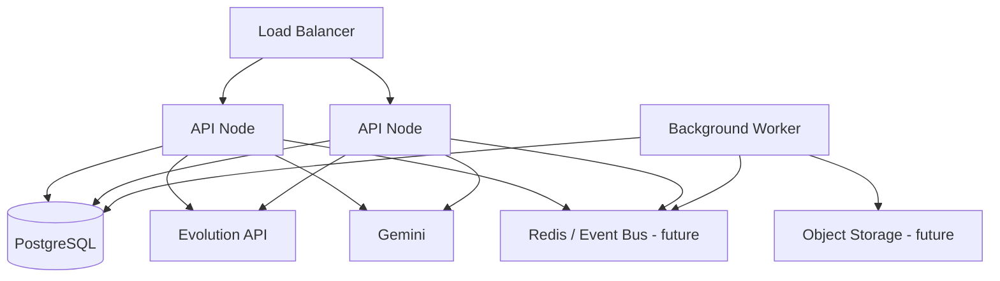

# Scalability Considerations

## Current Scaling Posture

The repository is operationally useful today, but its scaling assumptions are still those of a tightly integrated application server.

Current characteristics:

- in-process Socket.IO coordination
- process-local interval schedulers
- local filesystem media storage
- centralized relational state
- provider webhook ingress into the same application runtime

This is sufficient for early-stage and moderate operational scale, but introduces constraints for larger multi-tenant workloads.

## Multi-Tenant Considerations

The tenant model is already foundational.

Strengths:

- tenant-scoped data model
- configurable plan limits for users and connections
- per-tenant provider credentials
- tenant-scoped operational rooms in realtime transport

Scaling pressure points:

- large tenants can dominate shared worker capacity
- no workload partitioning by tenant tier or traffic class
- no tenant-aware job isolation yet

## Runtime Scaling

### What Scales Well Now

- stateless HTTP APIs behind a load balancer
- PostgreSQL-backed state reads and writes
- external provider connectivity because transport is delegated to Evolution
- route-level code splitting in the frontend, which reduces the initial operator-console bundle and keeps inbox-specific code off non-inbox routes

### What Does Not Scale Cleanly Yet

- repeated interval jobs on multiple replicas
- local media storage across replicas
- Socket.IO fan-out without shared adapter
- webhook deduplication beyond current message ID checks

### Console Delivery and Maintainability

A non-infrastructure but still important scaling improvement landed on May 15, 2026:

- the inbox was split into `components.jsx`, `hooks.js`, and `helpers.jsx`
- shared UI primitives were introduced under `frontend/src/components/ui/`
- the frontend now relies on route-level lazy loading

This does not create horizontal scale by itself, but it does improve engineering scale:

- smaller inbox surfaces reduce regression risk on future product changes
- shared UI primitives reduce divergence across admin, CRM, campaign, and inbox flows
- lazy loading keeps the operational console responsive as the route set grows

## Distributed Orchestration Possibilities

A likely evolution path:

- separate API nodes from worker nodes
- move schedule processing into a dedicated worker service
- adopt Redis or queue middleware for event transport
- add Socket.IO adapter for cross-node fan-out

## Connector Scaling

The most scalable connector in the current system is Evolution because it externalizes session ownership.

Connector scaling observations:

- transport scaling is bounded more by provider throughput and webhook load than by browser runtime constraints
- Gemini usage scales with AI invocation policy, especially media analysis and semantic retrieval
- local file storage becomes the main bottleneck once media throughput grows

## Queue and Event Architecture Possibilities

The current design already hints at future queueability:

- scheduled messages
- media retry
- AI enrichment after persistence
- operational event history

Natural future decomposition:

- inbound webhook queue
- media enrichment queue
- AI response queue
- scheduled send queue
- analytics or reporting queue

## Future MCP Compatibility

The repository is not MCP-native today, but several concepts map well:

- connectors can become MCP-compatible tools
- knowledge resources can become MCP-readable data resources
- instance and tenant state can be exposed through capability manifests
- AI and messaging domains can be split into tool-facing runtimes

Recommended MCP preparation steps:

- formalize connector manifests
- formalize capability descriptors
- separate command side effects from query resources
- isolate long-running tasks into job handlers

## Scalability Diagram

## Scaling Recommendations

Near-term:

- move uploads to object storage
- externalize scheduler ownership
- add Redis-backed Socket.IO adapter
- add structured metrics around webhook, AI, and media latency

Mid-term:

- split orchestration workers from public API
- introduce queue-backed retries and enrichment
- add tenant-priority execution classes

Long-term:

- formalize connector runtime contracts
- support non-WhatsApp channels through a shared capability layer
- evolve into a broader AI-assisted operations fabric rather than a single-channel inbox
