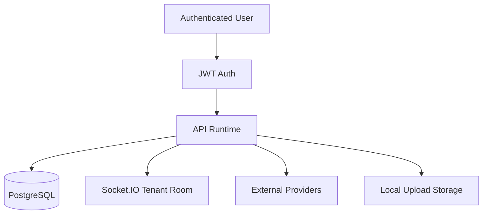

# Security Model

## Overview

The repository is a multi-tenant operational system with direct access to messaging channels, AI providers, customer content, internal notes, and media uploads. Security posture should therefore be evaluated as an infrastructure system, not as a basic chat UI.

## Session Isolation

Isolation is implemented primarily at the tenant level.

Observed boundaries:

- most data access is filtered by `tenantId`
- Socket.IO clients join tenant-scoped rooms
- JWT payload includes `tenantId`, `userId`, and `role`
- unique constraints scope operational records by tenant where relevant

Primary isolation models:

- tenant-scoped application access
- instance-scoped contact ownership
- ticket ownership for inbox segmentation

## Credential Handling

Current credential classes:

- JWT signing secret
- Evolution API URL and API key
- Gemini API key
- optional external webhook URLs

Current storage behavior:

- provider credentials are persisted in `TenantSettings`
- environment variables can supply defaults for Evolution
- JWT secret is process-level environment configuration

Consideration:

- tenant settings currently act as credential storage, so database-level encryption at rest is important

## Local Persistence Strategy

The application stores operational state locally in two forms:

- PostgreSQL records
- filesystem uploads under `/uploads`

Risks:

- local media files persist customer data
- single-host storage complicates consistent access control and retention enforcement

Mitigations already present:

- nightly cleanup for aging media
- explicit static serving path
- message records retain metadata even when binaries fail

## Browser Security Considerations

Current production runtime does not include browser automation.

However:

- schema-level support for `metaBrowserSession` implies future browser-session persistence
- if implemented, this would require encryption, profile isolation, and restricted export semantics

Documentation stance:

- browser-session threat surface is currently architectural, not operational

## OAuth Considerations

OAuth is not implemented in the active runtime.

Future Meta connector work would likely require:

- OAuth or delegated token handling
- refresh token rotation
- tenant-level connector revocation
- scoped capability mapping

## Cloud Synchronization Security

Two external trust boundaries dominate:

- Evolution API
- Google Gemini

Security implications:

- customer message contents leave the application boundary
- media may be transmitted for AI processing
- provider-side outages or malformed payloads can affect runtime stability

Recommended controls:

- outbound provider allowlists
- provider timeout budgets
- structured audit logs for external calls
- explicit tenant opt-in for AI processing of sensitive content

Recent hardening:

- the frontend now guards malformed message payloads before render
- inbox sections can fail independently instead of taking down the full route
- this reduces blast radius when provider-originated payloads arrive with unexpected shapes

## Threat Model

### Threat: Cross-Tenant Data Access

Mitigation:

- tenant-scoped queries
- tenant-scoped Socket.IO rooms
- role-based route protection

Residual risk:

- any controller missing tenant filters becomes a high-severity issue

### Threat: Provider Credential Exposure

Mitigation:

- credentials not exposed to frontend by default except configured settings access for admins

Residual risk:

- database compromise exposes tenant provider secrets unless encrypted

### Threat: Webhook Forgery

Observed state:

- webhook route accepts provider events
- no dedicated signature verification layer is evident in the active repository

Risk:

- spoofed inbound events if network perimeter is weak

Recommendation:

- add provider signature validation or shared-secret verification

### Threat: Provider Payload Variance and UI Crash Propagation

Observed state:

- provider-originated content can arrive with inconsistent or partial media and message fields
- this caused a production inbox rendering incident on May 15, 2026

Mitigation now present:

- route-level error boundary in `frontend/src/main.jsx`
- conversation-section isolation in the inbox
- defensive guards around media fields, history payloads, names, tags, and contact snapshot rendering

Residual risk:

- malformed payloads can still degrade individual message rendering
- data normalization closer to webhook ingestion would reduce downstream UI complexity further

### Threat: Media Retention and Leakage

Mitigation:

- media cleanup job
- local storage separation

Residual risk:

- static file serving exposes stored assets if URL leakage occurs

### Threat: Prompt-Level or Retrieval Abuse

Mitigation:

- AI is wrapped by server-side orchestration
- model fallback is controlled server-side

Residual risk:

- knowledge retrieval and contact memory extraction can amplify bad input if prompt controls are weak

## Security Diagram

